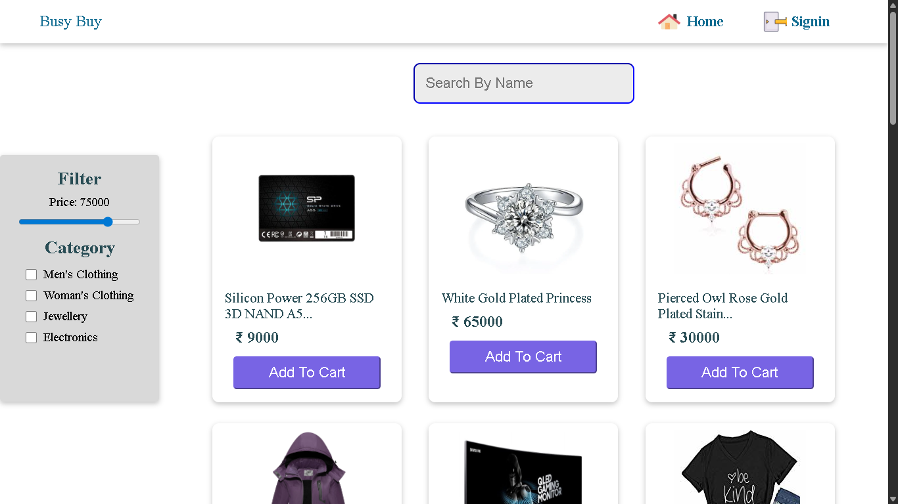
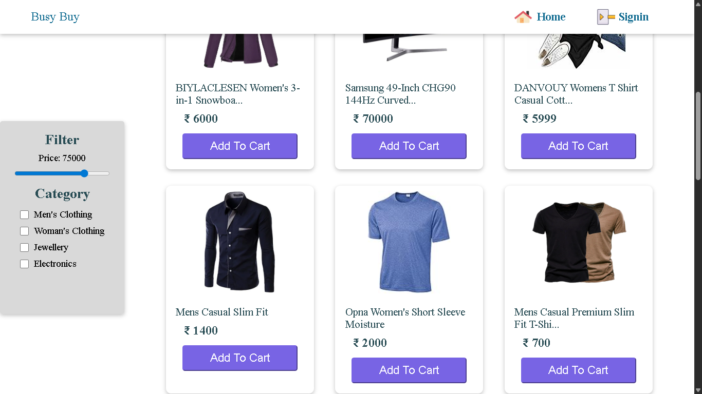
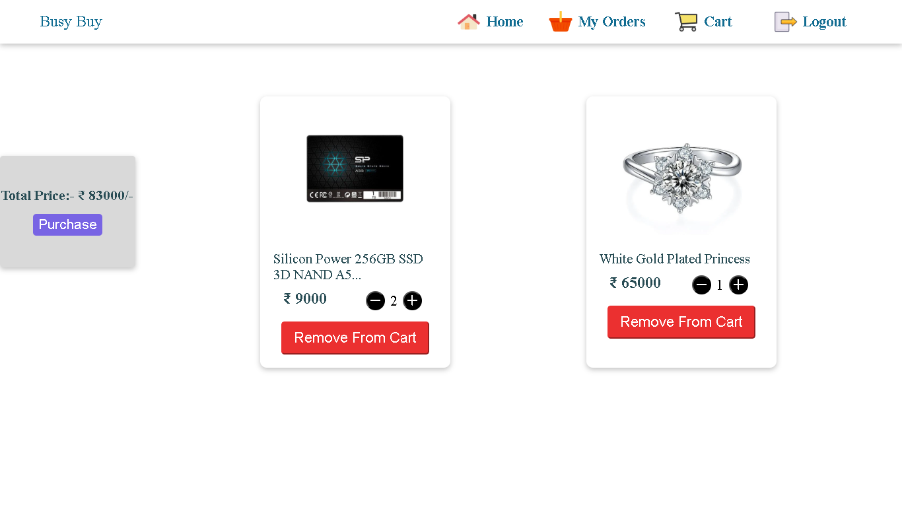
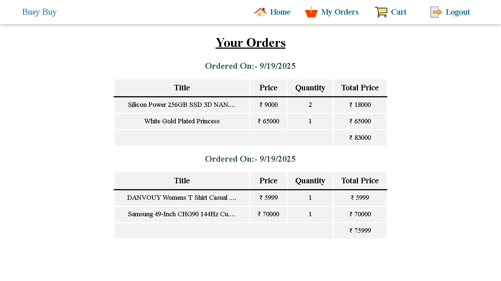

# BuyBusy – E-Commerce Order Management App

## 🚀 Overview
**BuyBusy** is a modern, built with React and Firebase that allows users to manage product orders efficiently. It includes user authentication, dynamic product forms, styled product cards, and an order summary table.

---

## 🛠 Tech Stack
### **Frontend**
- React with vite.
- Axios

### **Frontend**
- Firebase

---

## ✨ Features
- User Authentication – Secure login & signup using Firebase.
- Product Cards – Display items with quantity and pricing.
- Order Management – Add, track, and display orders in real-time.
- React Context API – Smooth global state handling.

---

## 📂 Project Structure
```
buy-busy/
├── config/
│   └── firebaseinit.js 
├── src/
│   ├── components/ 
│   ├── App.jsx 
│   ├── context.js
│   ├── main.jsx
│   └── index.css
├── index.html
├── package.json
├── vite.config.js
└── .gitignore
```

---

## 🚀 Deployment
- **Frontend:** Deployed on Netlify

---

The project is live!  
👉 **[View Live Demo](https://buy-busy-every.netlify.app/)**

---
---

## 📸 Screenshots





---

## 📞 Contact
- **Author:** Suraj Nishad
- **Email:** iamsuraj0737@gmail.com
